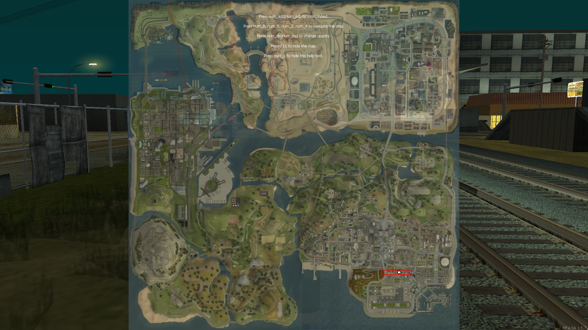

# Project trains

## Making your own traincarts

There is a map template included in this packet.
1. Copy the folder: /traincart-design-template
2. And place it one folder higher: server/mods/deathmatch/resources/traincart-design-template
3. Refresh the resources
4. Open the map editor and edit the template. BUT DO NOT MOVE / REMOVE any of the existing template elements. Those elements are set on the position 0,0,0. (Middle of the map) Which means that if you place your own elements near those existing elements, they will have an clean offset from the 0,0,0 position. This will come in handy to attach the elements with the correct offset later in the script.
5. **Save as** the map and give it name.
6. Also open the file: traincart-designs.xml
7. Place the following lines inside of the traincart-designs.xml, This is going to be your new train.
```XML
<train model="537">
	<cart model="569" >
		
	</cart>
</train>
```
8. Open the new created .map file inside of your notepad 

9. Copy the elements YOU created from the .map file.
```XML
<map edf:definitions="editor_main">
    <vehicle id="This ELEMENT. DO NOT REMOVE, DO NOT COPY AND DO NOT USE" paintjob="3" interior="0" alpha="255" model="569" plate="UQND Z2X" dimension="0" posX="0" posY="0" posZ="0" rotX="0" rotY="0" rotZ="0" color="0,0,0,0,0,0,0,0,0,0,0,0"></vehicle>
    <removeWorldObject id="This ELEMENT. DO NOT REMOVE, DO NOT COPY AND DO NOT USE" radius="178.77229" interior="0" model="13050" lodModel="13414" posX="50.17969" posY="-43.28125" posZ="0.98438" rotX="0" rotY="0" rotZ="0"></removeWorldObject>
    <object id="This ELEMENT. DO NOT REMOVE, DO NOT COPY AND DO NOT USE" breakable="true" interior="0" alpha="255" model="4247" doublesided="true" scale="1" dimension="0" posX="1.1" posY="3.5" posZ="-1.06" rotX="0" rotY="0" rotZ="0"></object>
</map>
```
10. And past them between the cart tag
```XML
<train model="537">
	<cart model="569" >
		<!-- objects from .map file -->
	</cart>
</train>
```
11. If you want to add multiple traincarts:
```XML
<train model="537">
	<cart model="569" >
		<!-- objects from .map file 1 -->
	</cart>
	<cart model="569" >
		<!-- objects from .map file 2 -->
	</cart>
	<cart model="569" >
		<!-- objects from .map file 3 -->
	</cart>
</train>
```

12.  You are finished now. Stop the editor and start the train script.


## Known bugs

There is an area on the map, that causes the train to spawn on the wrong track. This area is marked on the screenshot:



The bug is caused by GTA and it solves itself when the train continues to drive. The bug can be solved when the following function is implemented [setTrainTrack 1.6 ONWARDS](https://wiki.multitheftauto.com/wiki/SetTrainTrack).